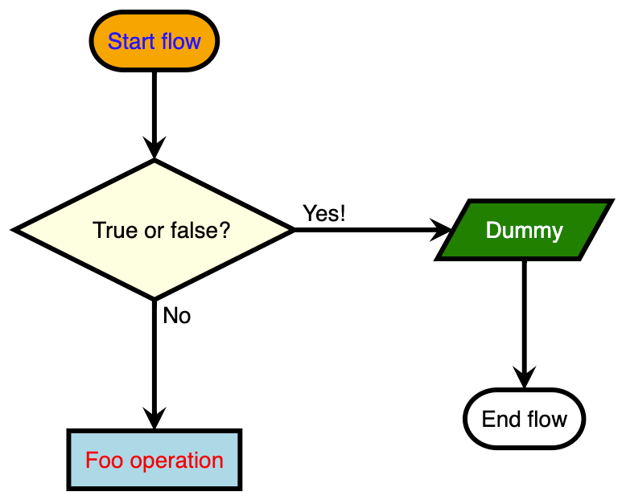

# react-flowchart.js

[](https://www.npmjs.com/package/react-flowchart.js)
[](https://www.npmjs.com/package/react-flowchart.js)

## Overview

**React wrapper of [flowchart.js](https://www.npmjs.com/package/flowchart.js).**  
A simple React component to create interactive flow charts, using [flowchart.js](https://www.npmjs.com/package/flowchart.js) behind the scenes.  
Built-in TypeScript support.

## Example

Please see the `./example/` folder for a simple example on how to use the component.

Flow chart example:



## Install

```bash
# Yarn
yarn add react-flowchart.js

# NPM
npm install --save react-flowchart.js
```

## Usage

Please see code below:

```jsx
import React from 'react';
import { Flowchart, FlowchartConfig, Node } from 'react-flowchart.js';

const App = () => {
  // Nodes (required) - this is our list of nodes to display in the flowchart.
  // The properties "type", "id" and "label" are required. Connections are optional.
  // Note that the structure of connections vary based on the node type (eg. "condition" allows both "yes" and "no" connections).
  // Please see the flowchart.js README for documentation on this: https://github.com/adrai/flowchart.js#node-specific-specifiers-by-type
  const nodes: Node[] = [
    {
      type: 'start',
      id: 'my_start_node',
      label: 'Start flow',
      state: 'highlighted', // Support for flowstate (allows you to modify the styling of a node based on this value)
      connection: {
        id: 'my_condition_node',
        position: 'bottom',
      },
    },
    {
      type: 'condition',
      id: 'my_condition_node',
      label: 'True or false?',
      connections: {
        yes: {
          id: 'dummy_node',
          position: 'right',
        },
        no: {
          id: 'my_operation_node',
          position: 'bottom',
        },
      },
    },
    {
      type: 'operation',
      id: 'my_operation_node',
      label: 'Foo operation',
    },
    {
      type: 'inputoutput',
      id: 'dummy_node',
      label: 'Dummy',
      connection: {
        id: 'end',
        position: 'bottom',
      },
    },
    {
      type: 'end',
      id: 'end',
      label: 'End flow',
    },
  ];

  // Config (optional) - here we configure the flowchart, eg. line width, font family, arrow type, yes and no texts, etc.
  const config: FlowchartConfig = {
    lineWidth: 3,
    yesText: 'Yes!',
    noText: 'No',
  };

  // Styles (optional) - here we define the base styling for our nodes based on the node type (the "type" property)
  const styles = {
    condition: {
      fill: 'lightyellow',
    },
    operation: {
      fill: 'lightblue',
      'font-color': 'red',
    },
    inputoutput: {
      fill: 'green',
      'font-color': 'white',
    },
  };

  // States (optional) - here we define styling for the flowstate defined on nodes (the "state" property)
  const states = {
    highlighted: {
      fill: 'orange',
      'font-color': 'blue',
    },
  };

  // OnClick (optional) - here we define a callback for when clicking a node
  const onClick = (item: any, mouseEvent: MouseEvent) => {
    console.log('Item clicked:', item);
    console.log('Mouse event:', mouseEvent);
  };

  return (
    <div>
      <h1>Flowchart example</h1>
      <Flowchart
        nodes={nodes}
        config={config}
        styles={styles}
        states={states}
        onClick={onClick}
      />
    </div>
  );
};
```

## Props / Config

```typescript
interface FlowchartProps {
  nodes: Node[]; // required
  config?: FlowchartConfig;
  styles?: {
    [nodeType: string]: Object;
  };
  states?: {
    [state: string]: Object;
  };
  onClick?: (item: any, mouseEvent: MouseEvent) => void;
}

interface FlowchartConfig {
  lineWidth?: number; // default: 2
  lineLength?: number; // default: 50
  textMargin?: number; // default: 10
  fontSize?: number; // default: 14
  fontFamily?: string; // default: Helvetica
  fontWeight?: string; // default: normal
  fontColor?: string; // default: black
  lineColor?: string; // default: black
  elementColor?: string; // default: black
  fill?: string; // default: white
  yesText?: string; // default: yes
  noText?: string; // default: no
  arrowEnd?: 'block' | 'classic-wide-long'; // default: classic-wide-long
  scale?: number; // default: 1
}
```

Please see `./src/types.ts` for type information on the `Node` type.

## Flowchart.js documentation

For documentation on how flowchart.js works please check out the [README of flowchart.js](https://github.com/adrai/flowchart.js).

## Contributions

Contributions are most welcome!

## Thanks

Thanks to Adriano Raiano for creating [flowchart.js](https://github.com/adrai/flowchart.js).

##
